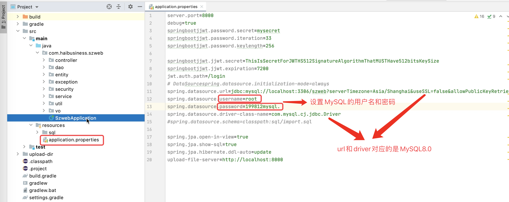
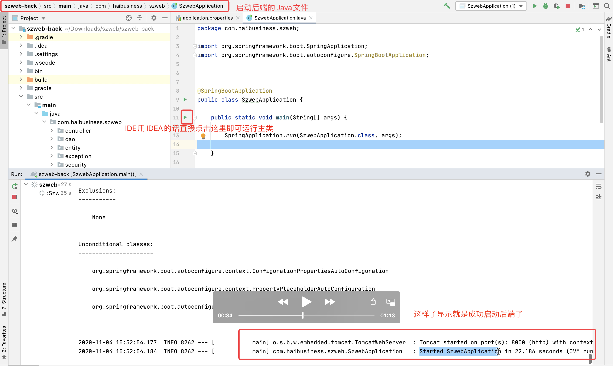
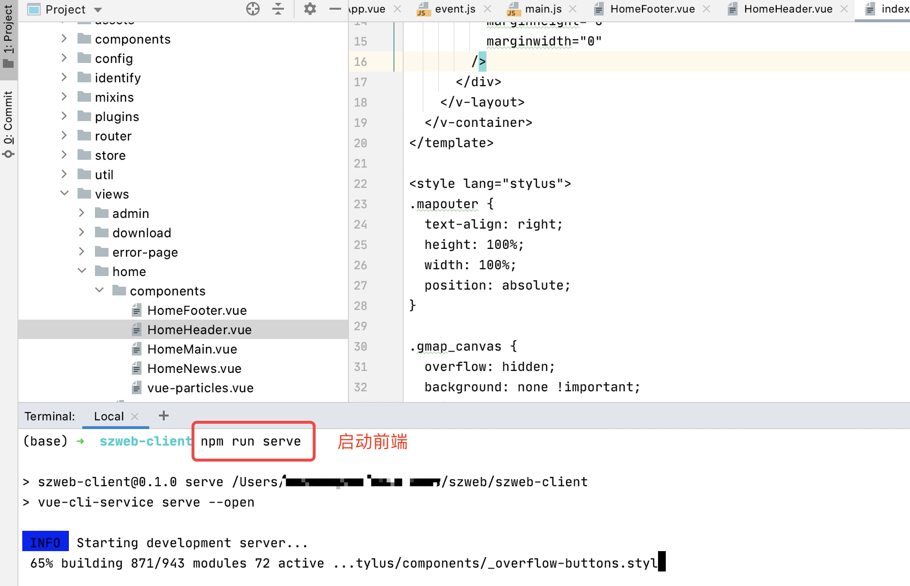
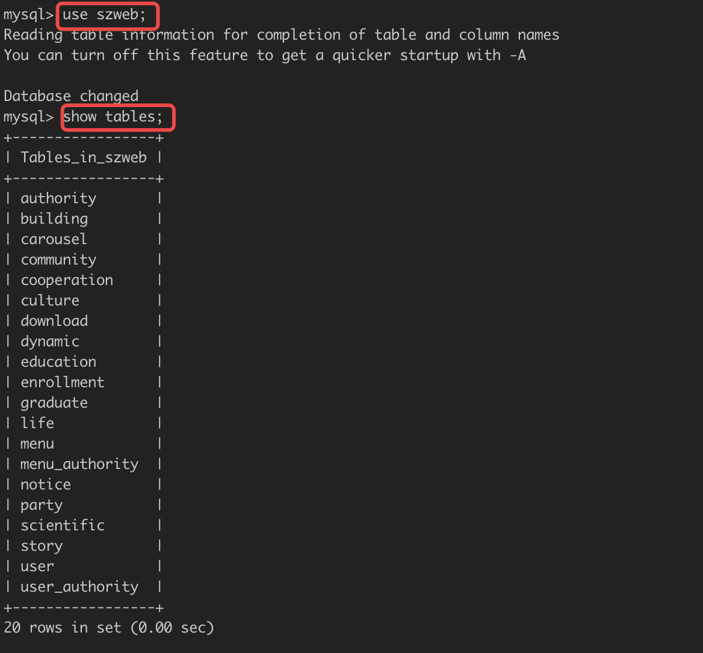
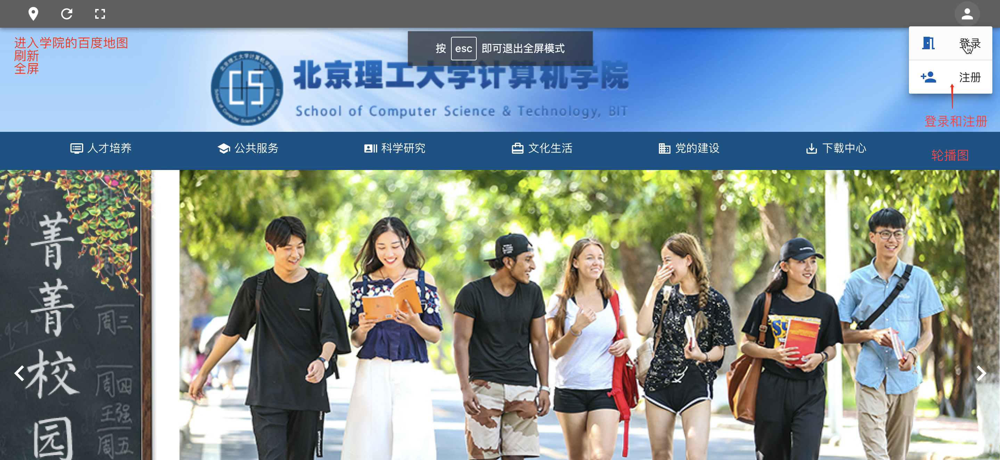
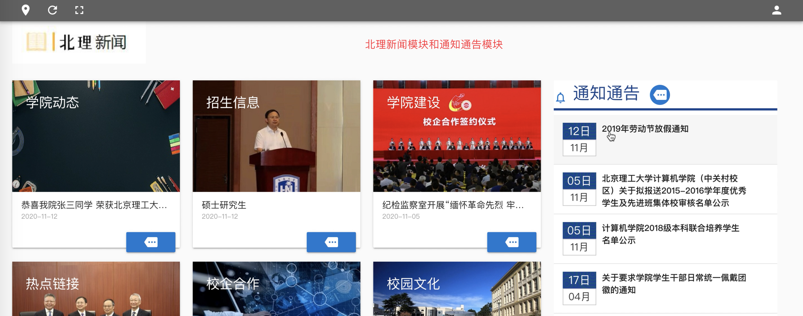
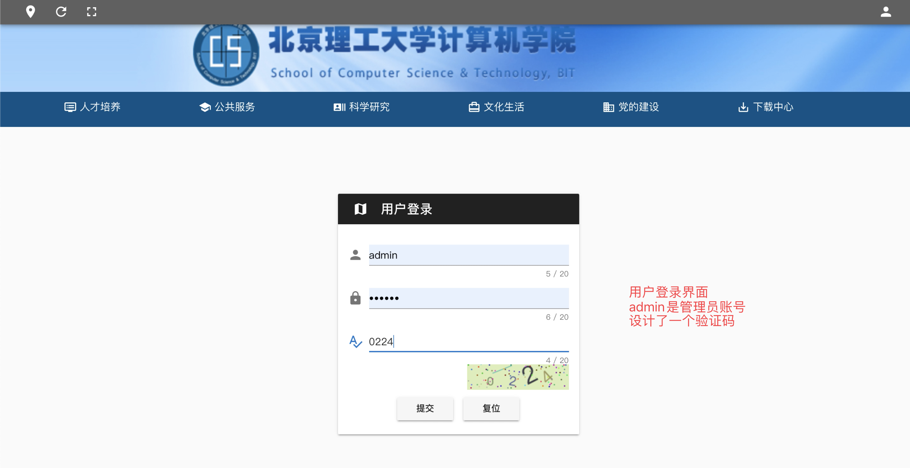
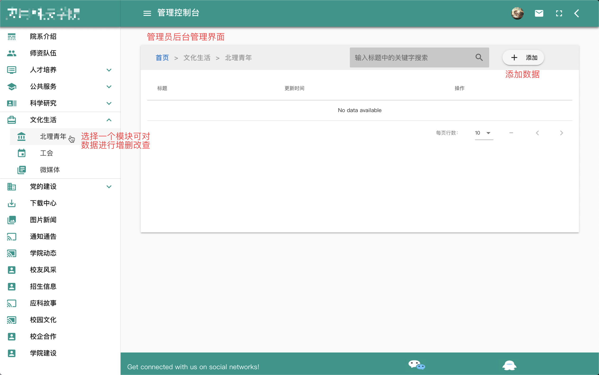

# 项目介绍

>如果GitHub加载太慢，可跳转至[码云](https://gitee.com/swhaledcc/schoolweb-vue-springboot)

这是一个前后端分离的学院网站，前端用的Vue2，后端用Spring Boot2，数据库用的MySQL8.0。

# 目录结构

- szweb-back文件夹：后端代码
- szweb-client文件夹：前端代码
- demo文件夹：项目效果展示

# 运行步骤

1. clone 项目到本地 `git clone https://github.com/swhaleDCC/schoolweb-vue-springboot.git` 。
2. 新建一个空的数据库szweb。
3. 打开后端代码，在配置文件application.properties里修改成自己电脑MySQL的用户名和密码，启动后端，后端端口是8000。
4. 需要手动导入数据库脚本，对应的SQL代码在szweb-back文件夹中。
5. 打开前端代码，在终端运行npm run serve，前端端口是8080，访问http://localhost:8080/ 即可看到前端页面。

# 项目效果图

后端代码文件夹下的配置文件：

后端启动：

前端启动：

数据库：

主界面：

登录窗口：

管理员账户的后台管理界面：

# 最后...
>这是我们专业课上入门的小项目，还有很多地方需要改进，比如文件下载啊，数据库脚步自动导入啊，等等，欢迎交流沟通！
